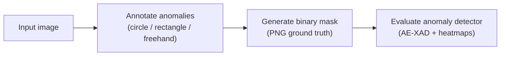

# 🎭 MaskGenerator

> A lightweight desktop tool to hand-label anomalous regions in images and export
> **binary ground-truth masks** — built as part of my B.Sc. thesis on explainable
> anomaly detection.


---

## 📌 What it does

Anomaly-detection models are usually evaluated against **ground-truth masks**: binary images
where anomalous pixels are white and everything else is black. Producing those masks by hand
is tedious, so **MaskGenerator** provides a simple GUI to draw the anomalous regions directly
on top of an image and export the corresponding mask with one click.

The tool was developed for a thesis pipeline in which anomalies are detected by **autoencoders
using the AE-XAD approach**, whose detections are then made explainable through heatmaps — the
masks produced here serve as the reference for evaluating those detections.

---

## ✨ Features

- 🖼️ **Load any image** and zoom / pan freely (mouse wheel + scroll)
- ✏️ **Three annotation modes:**
  - **Circle** — draw elliptical regions
  - **Rectangle** — draw rectangular regions
  - **Freehand** — trace an arbitrary polygon
- ↩️ **Undo** (`Ctrl+Z`) and **Reset** (`Ctrl+R`)
- ⚫⚪ **One-click mask generation** — rasterizes every annotation into a binary NumPy matrix
- 💾 **Export as PNG** (foreground = 255, background = 0)
- 🔁 **Load a new image** without restarting the app

---

## 🔄 Where it fits



---

## 🖥️ Screenshot

<!-- TODO: add a screenshot or short GIF of the tool in action (annotating + generated mask side by side). -->
<!--  -->

> _Screenshot coming soon._

---

## 🚀 Usage

### Prerequisites
```bash
pip install pillow numpy
```
(`tkinter` ships with most Python installations.)

### Run
```bash
python MaskGenerator.py
```
On launch you'll be asked to pick an image. Then:
1. Choose an annotation mode (Circle / Rectangle / Freehand).
2. Mark the anomalous regions on the image.
3. Click **Crea mask** and choose where to save the `.png` mask.

Use **Undo** / **Reset** to correct mistakes, and **Nuova immagine** to load another image.

---

## 👤 Author
**Giuseppe Zappia** — [GitHub](https://github.com/GiuseppeZappia)

> Part of my B.Sc. thesis work on explainable anomaly detection.
